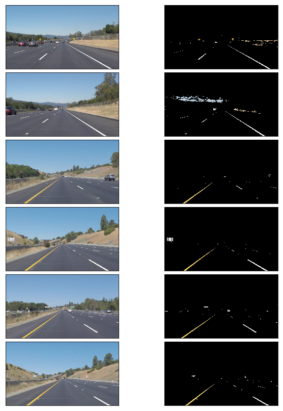
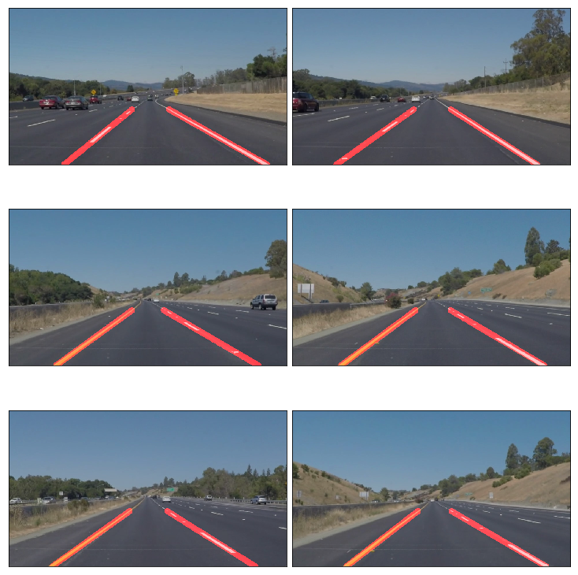

# **Finding Lane Lines on the Road** 

My solution to the https://github.com/udacity/CarND-LaneLines-P1

This writeup can also be found [here](writeup.md)

---

The goals / steps this project are the following:
* Detect lane markings on images
* Write a pipeline to extend this to a video

We use Python and OpenCV for this task.

## Reflection

### 1. The pipeline

Following are the steps of the pipeline.

#### 1. Color segmentation
Since the lanes have very specific range of colors, we start with color selection. This step helps narrow down on the features we're looking for for the next set of steps. We're looking for the whites and the yellows. Color selection is easier to perform in the HSV or HSL color space rather than RGB because of orthogonalization of colour and brightness.   The `select_lane_color` function does that for us. The thresholds have been manually tuned to have a reasonable selection.
```
def select_lane_color(img):
    # Convert the image to HSL for accurate color selection
    hlsImg = cv2.cvtColor(img, cv2.COLOR_RGB2HLS) 
    
    # A lane could either be white or yellow. Set appropriate color thresholds
    minWhite  = np.uint8([  0, 200,   0])
    maxWhite  = np.uint8([255, 255, 255])
    minYellow = np.uint8([ 10,   0, 100])
    maxYellow = np.uint8([ 40, 255, 255])
    
    whiteMask  = cv2.inRange(hlsImg, minWhite,  maxWhite)
    yellowMask = cv2.inRange(hlsImg, minYellow, maxYellow)
    
    return cv2.bitwise_and(img, img, \
           mask=cv2.bitwise_or(whiteMask, yellowMask))
```



#### 2. Marking the region of interest
The roads tends have a roughly trapezoidal shape because of the perspective transformation and we therefore choose a quadrilateral ROI to select the road.  Again the points have been manually chosen but expressed in terms of image dimensions to help making this a little robust to different image inputs.
```
def select_roi(img):
    height, width = img.shape[:2]
    bottomLeft  = [width*0.075, height*1.000]
    topLeft     = [width*0.480, height*0.550]
    bottomRight = [width*0.950, height*1.000]
    topRight    = [width*0.520, height*0.550] 
    
    vertices = np.array([[bottomLeft, topLeft, topRight, bottomRight]], \
                        dtype=np.int32)
    return vertices    
```
#### 3. Convert to grayscale
Color information is not required for the next steps  So we convert the image to grayscale.  We use the helper function `grayscale(image)` that is already provided.

#### 4. Gaussian blur
A Gaussian blur is applied to the image to remove unwanted high frequency components that could show up after edge detection. The `gaussian_blur(img, kernel_size)` function that was already provided was used for this purpose.

#### 5. Canny edge detection
Edge detection is our first step towards lane detection.  The provided  `canny(img, low_threshold, high_threshold)` function was used for this. The `low_threshold` and the `high_threshold` were tuned manually to get a reason detection of lane edges. 

#### 6. Detecting the lines with Hough transforms
The output of the edge detection is a set of points that correspond the edges in the image. To identify straight lines from these set of points, the `cv2.HoughLinesP` from OpenCV is used. A wrapper to this in the form of `cv2.HoughLinesP(img, rho, theta, ...` is already provided. The parameters, particularly the `threshold`, `min_line_length` and `max_line_gap` were manually tuned to get a good detection of lane edges.  The output of the function is of the `[x1, y1, x2, y2]` which indicate the end co-ordinates of the line segments detected.

#### 7. Find lanes from the lines
We need to two lines, one corresponding to each of the left and right lanes. The Hough transform, however, gives us multiple line segments depending on the lane markings, lighting, noise and other features in the image. We therefore, have to use these multiple line segments to give us the two lane lines we need. We take the following approach. 

For each of the lines,
1. We find the calculate its slope and the intercept. 
2. The images we have are fairly clean, especially in our ROI. Therefore we assume (and also observe) that all the lines we have belong to our lanes - the ones with negative slope belong to the left lane and others belong to the right lane. We therefore divide the lines into two groups. Therefore, the slope/intercept of the line corresponding to the left lane should be the mean of slopes/intercepts of all the lines in that group and similarly of the right lane. 

Mean is sensitive to outliers and we sometimes notice very short noisy line segments affecting our slope estimates. The same pixel error corresponds to a larger error in slope for line segments that are shorter. We therefore,  choose to weigh every line segment according to its length. The following function does that for us.

```
def lanes_from_lines(lines):

    leftLines   = []
    leftWeights = []
    rightLines  = []
    rightWeights= []
    leftLane    = None
    rightLane   = None
        
    for line in lines:
        x1, y1, x2, y2 = line[0]      
        if x1 == x2: #ignore vertical lines
            continue
        slope = (y2-y1)/(x2-x1)
        intercept = y1 - slope*x1
        length = np.sqrt((x2-x1)**2 + (y2-y1)**2)
        # Divide into left and right based on the slope. This criterea 
        # should be enough for the sparse lines that we have. Might not
        # work with the roads that have repair artifacts etc
        if slope < 0:
            leftLines.append((slope, intercept))
            leftWeights.append((length))
        else:
            rightLines.append((slope, intercept))
            rightWeights.append((length))
    
    # Smaller lines tend to be noisier. To weight larger lines higher
    if len(leftLines)  != 0:
        leftLane  = np.dot(leftWeights , leftLines )/np.sum(leftWeights)
        
    if len(rightLines) != 0:    
        rightLane = np.dot(rightWeights, rightLines)/np.sum(rightWeights)
    
    return leftLane, rightLane
```
#### 8. Drawing the lanes
So far we have equation of  two lines that correspond, one each corresponding to the left and the right lane. We use the following to draw these lanes on the image. 
1. The `fill_roi_line(line, roi, fillfac=0.85)` function used to compute the line segment to be displayed from the the ROI vertices. The `fillfac` parameter is used to limit the line segment to slightly below the top limit of the ROI. 
```
def fill_roi_line(line, roi, fillfac=0.85):
    """
    Compute the line segment to be display from the line equation.
    """

    if line is None:
        return None
    
    slope, intercept = line
    
    ymin = np.squeeze(roi)[1][1]/fillfac
    ymax = np.squeeze(roi)[0][1]
    
    xmin = (ymin-intercept)/slope
    xmax = (ymax-intercept)/slope
    
    return np.array([[int(xmin), int(ymin), int(xmax), int(ymax)]], dtype=np.int32)
```
2. The second step of the drawing takes in the two line segments and uses the following function to overlay it on the original image. The following function comes from modifying the  ` draw_lines(img, lines ... ` that is already provided. It uses the `weighted_img(drawImage, img)`  that is already provided.

```
def draw_lines_alpha(img, lines, color=[255, 0, 0], thickness=10):
    """
    Draws lines on the input img. Same behaviour as draw_lines except that this function adds 
    transparency to the lines
    """
    drawImage = np.zeros_like(img)
    
    for line in lines:
        if line is not None:
            for x1,y1,x2,y2 in line:
                cv2.line(drawImage, (x1, y1), (x2, y2), color, thickness)
            
    return weighted_img(drawImage, img)
```

### 2. The pipeline

The `lane_detect(img, singleLaneLines=True)` integrates the above functions to detect and draw lanes. 

```
def lane_detect(img, singleLaneLines=True):
    """
    Function to take in an image (or a frame) img and output an image with 
    annotated right and left lanes
    
    The singleLaneLines parameter switches between displaying just Hough lines 
    for lanes and average single lines for each lane
    """
    roiVertices = select_roi(img)
    imgRoi = region_of_interest(img, roiVertices)
    
    ## select colour -> convert to grayscale -> apply gaussian blur
    grayImg = gaussian_blur(grayscale(select_lane_color(imgRoi)), 9)

    ## Canny edge dectection
    edgeImg = canny(grayImg, 50, 100)

    if singleLaneLines:
        lines = hough_lines(edgeImg, rho=1, theta=np.pi/180, threshold=30, \
                       min_line_len=20, max_line_gap=400)
       
        leftLane, rightLane = lanes_from_lines(lines)
       
        laneLines = np.array([fill_roi_line(leftLane , roiVertices),\
                         fill_roi_line(rightLane, roiVertices)])
    
        result = draw_lines_alpha(img,laneLines, thickness=20)
    else:
        houghImg = hough_lines_img(edgeImg, rho=1, theta=np.pi/180, 
                         threshold=30, min_line_len=20, max_line_gap=400)
        result = weighted_img(houghImg, img )
    
    return result
```

#### The results
The results on all the images provided are stored in the `test_images_output` folder and also shown in the mosaic below.  Video ouputs are stored in the  `test_videos_output` folder.



#### Comments on the challenge video

The challenge video is different from the initial test images in a couple of aspects. First, there is a continuous yellow lane marking on the left. This does not pose problems to our pipeline as we tuned our color selection thresholds well for both the whites and the yellows. Second, the ahead is curved. However, the lane markings closer to the vehicle are still straight enough for the `cv2.HoughLinesP` functions detect a good number of lines in the image.  Consequently our pipeline is robust enough to work for this video, albeit for markings relatively close to the vehicle. The output of this video is stored in the repository as `test_videos_output/challenge.mp4`.

### 3. Potential shortcomings and improvements

1. ROI selection is clearly not perfect. The manual selection of ROI does not scale well to all situations. For example, the ROI will be much lower in the field of view when the road either slopes down and will be much higher when it slopes up. In addition, the current ROI selection also does not work when the car is switching lanes. One could probably segment the road, perhaps using a color range and use the road as an ROI to find lanes. 
2. The algorithm assumes lanes are straight lines. While is a reasonable assumption to make on straight or lightly curved roads, this might not be true around sharp turns. This is also a situation that needs very accurate lane keeping and steering control. So lane detection performance would probably be critically important in this situation.  If the roads are assumed to be circular arcs it should be possible to describe the lane parametrically after a perspective transformation of the arc. Hough transform should generalize to such parametric curves. If the curve is not parametrically known, a graph search based method can be used on the gradient to follow the lane markings.
3. After Hough transform finds the lines, we assume they either belong to one of the lanes. This assumption could fail under certain lighting conditions and when there are construction artifacts on the road. These lines can corrupt our slope estimates. We could filter the estimates by choosing the lines in a certain range of slopes. A starting point for this range could be computed theoretically by assuming a range in the lane widths and knowing the perspective transform of the camera. 


